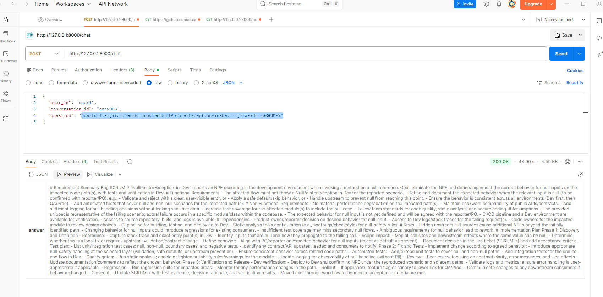
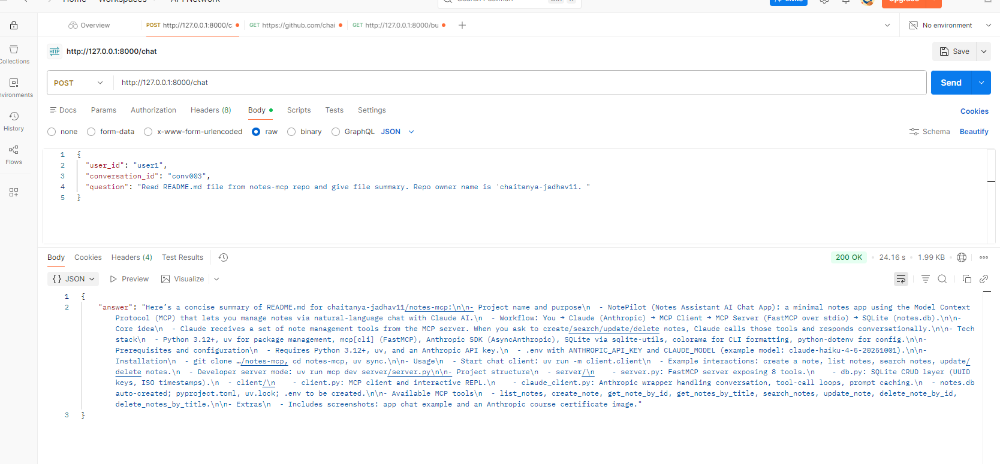

# Enterprise AI Engineering Platform

A multi-agent platform that helps engineering teams with day-to-day software work — analyzing
requirements from Jira, exploring GitHub repositories, and producing development plans. It is built
on [LangGraph](https://github.com/langchain-ai/langgraph) for agent orchestration and the
[Model Context Protocol (MCP)](https://modelcontextprotocol.io/) for connecting to external systems
(Jira and GitHub), and is served over a [FastAPI](https://fastapi.tiangolo.com/) HTTP API.

A **supervisor agent** routes each incoming request to the right specialized agent, which then uses
MCP tools to gather context before producing a structured answer.

## Features

- **Supervisor routing** — classifies each request and dispatches it to the appropriate workflow.
- **Requirement analysis (Jira)** — retrieves stories/epics/tasks via Jira MCP tools and produces a
  detailed implementation plan (no code).
- **Repository analysis (GitHub)** — inspects a GitHub repository via GitHub MCP tools and produces
  an impact analysis and development plan.
- **Tool-calling loops** — each agent can iteratively call MCP tools and feed results back into the
  reasoning step until it has enough context to answer.
- **LangSmith tracing** — optional observability for runs and evaluations.

> **Note:** The supervisor prompt advertises additional workflows (PR review, test generation,
> documentation, incident analysis). Only `REQUIREMENT_ANALYSIS` (Jira) and `REPOSITORY_ANALYSIS`
> (GitHub) are wired into the graph today; the rest are planned.

## Architecture

```
START
  │
  ▼
supervisor_node ── route_task ──┐
  │                             │
  ▼                             ▼
jira_agent                 github_agent
  │  ▲                          │  ▲
  ▼  │ (loop)                   ▼  │ (loop)
jira_tools                 github_tools
  │                             │
  └──────────► response_node ◄──┘
                   │
                   ▼
                  END
```

1. **`supervisor_node`** classifies the request into a `task_type` using a structured-output LLM.
2. **`route_task`** routes `REQUIREMENT_ANALYSIS` → `jira_agent` and `REPOSITORY_ANALYSIS` →
   `github_agent`.
3. Each agent decides whether to call MCP tools. If it requests a tool call, the graph routes to the
   corresponding `*_tools` node and loops back to the agent with the tool output.
4. When the agent produces a final answer (no tool calls), the graph routes to **`response_node`**,
   which extracts the last AI message into `final_answer`.

A rendered graph image is generated at startup under `workflow_image/graph_builder.png`.

### Project structure

```
enterprise-ai-engineering-platform/
├── main.py                     # FastAPI app entrypoint; initializes MCP + builds graph on startup
├── api/
│   ├── chat_api.py             # /chat and /chat1 endpoints
│   └── chat_models.py          # Request/response Pydantic models
├── core/
│   ├── llm.py                  # LLM + tool bindings (router, Jira, GitHub)
│   └── db.py                   # PostgreSQL SQLDatabase connection
├── graph/
│   ├── graph_builder.py        # Builds and compiles the LangGraph
│   ├── conditional_edges.py    # Routing logic between nodes
│   └── state.py                # AgentState + router output schema
├── nodes/
│   ├── supervisor/router_node.py
│   ├── requirement/jira_nodes.py
│   ├── repository/git_nodes.py
│   └── common.py               # response_node
├── tools/
│   ├── common_node_tools.py    # Selects Jira/GitHub tool subsets
│   ├── jira_tools.py
│   └── githubs.py
├── app_mcp/clients/mcp_manager.py  # MultiServerMCPClient setup
├── prompts/system_prmpts.py    # Supervisor and agent system prompts
└── mc-atlassian-server-setup   # Notes for running the Jira MCP server
```

## Prerequisites

- **Python 3.12+**
- **[uv](https://github.com/astral-sh/uv)** for dependency and environment management
- **PostgreSQL** running locally (database `ai-engineering-platform`)
- **OpenAI API key**
- **GitHub personal access token** (for the GitHub MCP server)
- **Atlassian/Jira API token** (for the Jira MCP server)
- **`uvx`** (ships with uv) to run the Atlassian MCP server

## Configuration

Create a `.env` file in the project root with the following variables:

```dotenv
# LLM
OPENAI_API_KEY=sk-...

# GitHub MCP
GITHUB_TOKEN=ghp_...

# Jira MCP
JIRA_URL=https://<your-org>.atlassian.net
JIRA_USERNAME=<your-email>@example.com
JIRA_API_TOKEN=<your-atlassian-token>

# LangSmith (optional, for tracing/evaluation)
LANGSMITH_TRACING=true
LANGSMITH_ENDPOINT=https://api.smith.langchain.com
LANGSMITH_API_KEY=ls-...
LANGSMITH_PROJECT=enterprise-ai-engineering-platform
```

Update the PostgreSQL connection string in `core/db.py` with your credentials:

```python
db = SQLDatabase.from_uri(
    "postgresql://postgres:<pass>@localhost:5432/ai-engineering-platform",
    ...
)
```

## Installation

```bash
# Clone the repository
git clone <repo-url>
cd enterprise-ai-engineering-platform

# Install dependencies into a managed virtualenv
uv sync
```

## Running the application

The platform depends on two MCP servers being reachable. Start them before launching the API.

### 1. Start the Jira (Atlassian) MCP server

See `mc-atlassian-server-setup` for full details. In short:

```bash
# In a separate terminal (PowerShell)
$env:JIRA_URL="https://<your-org>.atlassian.net"
$env:JIRA_USERNAME="<your-email>@example.com"
$env:JIRA_API_TOKEN="<your-atlassian-token>"

uvx mcp-atlassian --transport streamable-http --stateless --port 9000
```

This exposes the Jira MCP server at `http://localhost:9000/mcp`.

### 2. GitHub MCP server

The GitHub MCP endpoint (`https://api.githubcopilot.com/mcp/`) is hosted; it is authenticated with
your `GITHUB_TOKEN` and requires no local process.

### 3. Start the API

```bash
uv run uvicorn main:app --reload
```

On startup the app initializes the MCP clients, loads tools, and compiles the LangGraph. The API is
available at `http://127.0.0.1:8000` with interactive docs at `http://127.0.0.1:8000/docs`.

## API

### `POST /chat`

Asynchronous chat endpoint that runs the agent graph.

**Request body**

```json
{
  "user_id": "user-123",
  "conversation_id": "conv-456",
  "question": "Break down PROJ-101 into an implementation plan"
}
```

**Response**

```json
{
  "answer": "# Requirement Summary\n..."
}
```

The `thread_id` used for graph state is derived from `user_id` + `conversation_id`.

A synchronous variant is also available at `POST /chat1` with the same request/response schema.

### Example

```bash
curl -X POST http://127.0.0.1:8000/chat \
  -H "Content-Type: application/json" \
  -d '{
        "user_id": "user-123",
        "conversation_id": "conv-456",
        "question": "Analyze the repository owner/repo and plan adding JWT auth"
      }'
```

## Demos

| Jira requirement analysis | GitHub repository analysis |
| --- | --- |
|  |  |

## Tech stack

- **Orchestration:** LangGraph, LangChain
- **LLM:** OpenAI (via `langchain-openai`)
- **Integrations:** Model Context Protocol — Jira (`mcp-atlassian`) and GitHub
- **API:** FastAPI + Uvicorn
- **Persistence:** PostgreSQL (`psycopg`/`psycopg2`)
- **Observability:** LangSmith
- **Tooling:** uv, pytest


## Roadmap

- Wire up the remaining supervisor workflows: PR review, test generation, documentation, and
  incident analysis.
- Persistent conversation memory and checkpointing.
- Confluence, Slack, and observability (Grafana/Prometheus) connectors.
